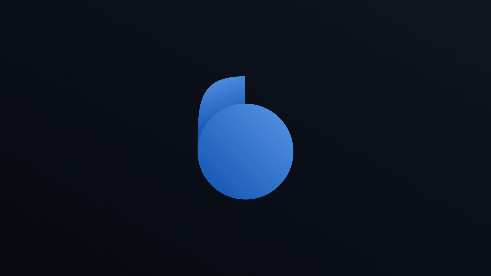
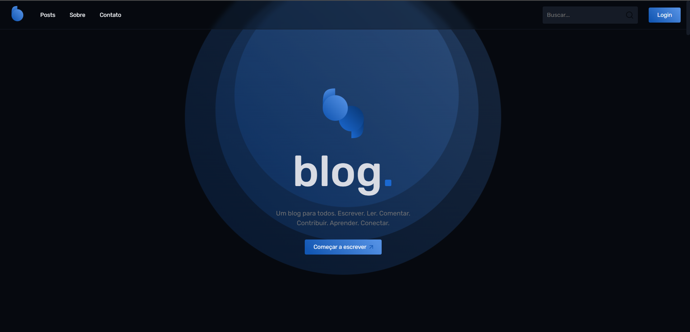
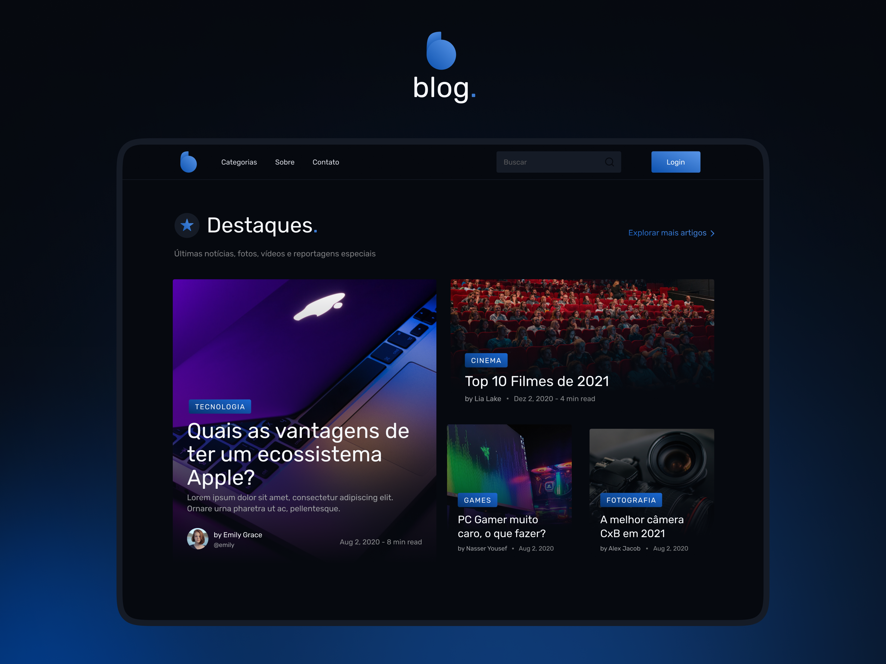
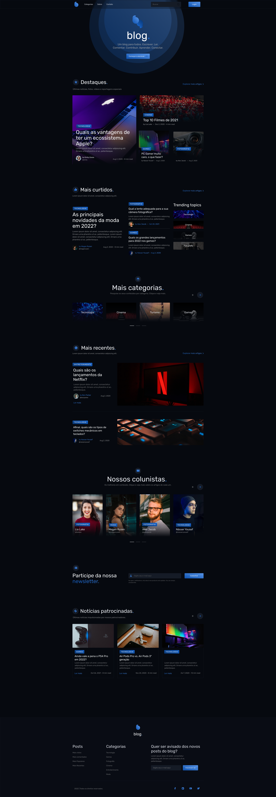

<h1 align="center">
    Project Blog
</h1>
<h1 align="center">
    
    <br>
</h1>

<h4 align="center">
  <p>Blog</p>
  
  <p>Implementation of a modern Blog application and API requests, made in React.js. </p>

  <p>This application was developed during the FrontPush from Nasser Yousef.</p>

  <p>
  In this project we built an awesome landing page from the beginning.

We started by creating the UI Design of aplicaton. And finally we developed the page using React, SASS and Javascript with API JsonServer

  </p>
</h4>

<div>
    
</div>

<div>
    
</div>

## How to use

To clone and run this application, you'll need Git, Node.js v10.16 or higher + Yarn v1.13 or higher installed on your computer. From your command line:

```bash
# Clone this repository
$ git clone https://github.com/Breno1210/Blog.git

# Go into the repository
$ cd Blog

# Install dependencies
$ yarn install

# Run the app 
$ yarn start

# Create another terminal
$ json-server --watch db.json --port 4000

Refresh the page (F5)

```

<h1 align="center">
    UI-Final
</h1>
<h1 align="center">
    
    <br>
</h1>

## ✒️ Author

- [@Breno1210](https://github.com/Breno1210)
- Teacher [Násser Yousef Ali](https://github.com/nyousefali)
